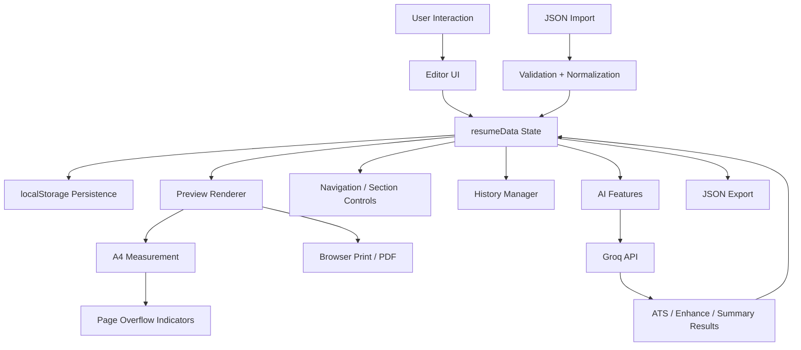

# ResumeStudio 🎯
### *Where Great Resumes Begin*

A browser-based resume builder built with **HTML, CSS, and Vanilla JavaScript**. ResumeStudio combines a structured resume editor, customizable layouts, local persistence, JSON backup/restore, browser-based PDF printing, and AI-powered resume assistance in a single client-side application.

> 🔗 **Live Demo** — https://patelpreet123.github.io/ResumeStudio/  
> 💻 **GitHub** — https://github.com/Patelpreet123/ResumeStudio

---

## 📌 Table of Contents

- [About the Project](#about-the-project)
- [Why ResumeStudio](#why-resumestudio)
- [Architecture](#architecture)
- [Core Data Model](#core-data-model)
- [Features](#features)
  - [Resume Layouts](#resume-layouts)
  - [Dynamic Sections](#dynamic-sections)
  - [Profile Links](#profile-links)
  - [Custom Sections](#custom-sections)
  - [Inline Formatting](#inline-formatting)
  - [Settings & Themes](#settings--themes)
  - [Undo / Redo](#undo--redo)
  - [Drag-and-Drop Reordering](#drag-and-drop-reordering)
  - [A4 Page Overflow Detection](#a4-page-overflow-detection)
  - [Print to PDF](#print-to-pdf)
  - [JSON Export & Import](#json-export--import)
- [AI Features](#ai-features)
  - [AI-Powered ATS Evaluation](#ai-powered-ats-evaluation)
  - [AI Enhance](#ai-enhance)
  - [AI Generate Summary](#ai-generate-summary)
  - [AI Request Flow](#ai-request-flow)
  - [AI Setup](#ai-setup)
- [Data Persistence](#data-persistence)
- [Technical Highlights](#technical-highlights)
- [Security & Privacy](#security--privacy)
- [Known Limitations](#known-limitations)
- [Getting Started](#getting-started)
- [Demo Resume](#demo-resume)
- [Interactive Tutorial](#interactive-tutorial)
- [Tech Stack](#tech-stack)
- [What I Learned](#what-i-learned)
- [Feedback](#feedback)
- [Author](#author)

---

## About the Project

ResumeStudio is a **single-page, client-side resume editor** designed around a structured `resumeData` state object.

Instead of storing the rendered resume as raw HTML, the application stores the underlying resume data—personal information, links, settings, section definitions, and section items—and regenerates the editor and preview from that state.

The project was built as a practical exercise in browser-based application development, with a focus on state management, DOM rendering, persistence, history management, document layout, API integration, and user experience.

---

## Why ResumeStudio?

ResumeStudio is designed primarily for **students and early-career developers** creating resumes for software engineering internships and campus placements.

The project focuses on common resume-building problems:

- Managing multiple resume sections without editing HTML manually
- Reordering sections and individual items quickly
- Keeping resume data available after page reloads
- Moving resume data between browsers/devices through JSON backups
- Checking whether the resume fits within an A4 page
- Producing a clean printable resume
- Using AI to improve bullets, generate summaries, and perform ATS-style evaluation

---

## Architecture

ResumeStudio follows a simple state-driven client-side architecture:



### Main application flow

```text
User edits resume
       ↓
updateState(...)
       ↓
resumeData changes
       ↓
saveData()
       ├── persist to localStorage
       ├── apply settings
       ├── render preview
       ├── render navigation
       └── record history
```

This keeps the application centered around one structured source of truth rather than maintaining separate editor and preview data.

---

## Core Data Model

The entire resume is represented as a structured JavaScript object:

```text
resumeData
├── template
├── isDemo
├── settings
│   ├── accentColor
│   ├── lineHeight
│   ├── pagePadding
│   ├── font
│   └── aiApiKey
├── personal
│   ├── name
│   ├── role
│   ├── email
│   ├── phone
│   ├── location
│   └── links[]
└── sections[]
    ├── text
    ├── education
    ├── experience
    ├── skills
    ├── project
    └── simple
```

Each section has its own data structure while sharing common concepts such as:

- `id`
- `title`
- `type`
- `column`
- `items` for list-based sections

This makes the editor and renderer data-driven and allows custom sections to be created without hardcoding a new page for every section type.

---

# Features

## Resume Layouts

Two resume layouts are available:

| Layout | Description |
|---|---|
| **Two Column** | Main column for core content + side column for supporting information |
| **Single Column** | All sections arranged vertically |

Switching layouts is supported directly from the application. Layout-specific spacing and padding defaults are automatically applied.

---

## Dynamic Sections

ResumeStudio includes the following default sections:

| Section | Type |
|---|---|
| Profile Summary | Paragraph text |
| Education | Degree, institution, dates, grade |
| Experience | Role, company, date, description |
| Technical Skills | Skill categories with lists |
| Projects | Name, date, description, Live/GitHub links |
| Field of Interest | Bullet list |
| Achievements | Bullet list |
| Hackathons | Name, date, description, links |
| Hobbies | Paragraph text |

Each section can be:

- Renamed
- Reordered
- Moved between columns
- Deleted
- Populated with multiple items where applicable

---

## Profile Links

Predefined profile slots are available for:

- LinkedIn
- GitHub
- LeetCode
- CodeForces
- CodeChef
- HackerRank
- Codolio

Links can be reordered, removed, or extended with custom platforms. Only links with a URL are rendered on the resume.

URLs are validated before being rendered as links.

---

## Custom Sections

The **➕ Add Section** feature allows users to create their own sections.

Each custom section has:

### Section Title
Use any title such as:

- Certifications
- Open Source
- Publications
- Coursework
- Volunteer Experience

### Format Type

| Type | Best For |
|---|---|
| Projects / Hackathons | Name, date, description, links |
| Experience | Role, company, date, description |
| Technical Skills | Skill categories + skill lists |
| Education | Degree, institution, dates, grade |
| Bullet List | Achievements, interests, activities |
| Paragraph | Free-form text |

### Column

In Two Column mode, a custom section can be assigned to:

- Main column
- Side column

---

## Inline Formatting

Text fields support lightweight inline formatting without requiring a rich text editor:

| Syntax | Result |
|---|---|
| `**text**` | **Bold** |
| `*text*` | *Italic* |
| `__text__` | <u>Underline</u> |
| `++text++` | Larger emphasis |

Text is escaped before formatting is applied, preventing raw user HTML from being directly inserted into the generated resume.

---

## Settings & Themes

The settings panel provides resume-level customization.

### Accent Color

A full color picker plus predefined color swatches are available.

### Theme Presets

- Minimal Black — Calibri
- Navy Pro — Arial
- Warm Maroon — Georgia
- Royal Purple — Garamond

### Font Family

Six font choices are available:

- Calibri
- Arial
- Georgia
- Garamond
- Times New Roman
- Palatino

### Layout Controls

- Line spacing: **1.0 → 2.0**
- Page padding: **5mm → 30mm**
- Section ordering
- Section column placement

Settings are applied directly to the generated resume preview.

---

## Undo / Redo

ResumeStudio includes state-based undo/redo with a maximum of **50 saved states**.

### Controls

- `↩ Undo`
- `↪ Redo`
- `Ctrl + Z`
- `Ctrl + Y`
- `Ctrl + Shift + Z`

### Implementation

Instead of storing individual UI operations, the application stores serialized snapshots of `resumeData`.

```text
resumeData
   ↓
JSON.stringify(...)
   ↓
historyStack[]
```

Typing is **debounced by 700ms**, so every individual keystroke does not create a separate history state.

This keeps the implementation simple while still providing useful editing history.

---

## Drag-and-Drop Reordering

Items inside sections can be reordered using a drag handle.

Supported examples include:

- Projects
- Education entries
- Experience entries
- Hackathons
- Skills
- Bullet-list sections

Section ordering itself is handled separately through the section navigation controls.

---

## A4 Page Overflow Detection

ResumeStudio checks whether the generated resume exceeds a single A4 page.

Instead of relying on a hardcoded pixel conversion, the application creates a hidden DOM ruler with:

```text
210mm × 297mm
```

It then measures the rendered resume content and compares its height with the measured A4 height.

When the content exceeds one page:

- A page overflow indicator appears
- Dashed page-break lines are rendered
- Each break is labelled with the next page number

Example:

```text
┌───────────────────────────────┐
│                               │
│        Resume Content         │
│                               │
├ - - - Page 2 starts here ✂ - -┤
│                               │
│        Additional Content     │
│                               │
└───────────────────────────────┘
```

This is intended to help users identify pagination problems before printing.

---

## Print to PDF

Click **Print PDF** when your resume is ready.

> **Best results:** Use **Google Chrome** and set print margins to **None** in the print dialog.

The editor panel, tutorial overlays, and page break lines are all hidden during print. Only the clean resume renders.

---

## JSON Export & Import

ResumeStudio supports portable JSON backups.

### Export

Click **💾 Export** to download the current resume state as a `.json` file.

The exported data includes:

- Resume settings
- Personal information
- Profile links
- Sections
- Section contents
- Layout configuration

The API key is removed from exported JSON data.

### Import

Click **📂 Import** and select a previously exported JSON file.

The imported data is:

1. Parsed
2. Structurally validated
3. Normalized against the application's default data model
4. Loaded into `resumeData`
5. Persisted to local storage

### Why JSON export matters

- Backup a resume before major edits
- Move a resume between browsers/devices
- Keep multiple resume versions
- Share a structured resume file with another ResumeStudio instance

---

# AI Features

ResumeStudio integrates AI through the **Groq API** using:

**Model:** `openai/gpt-oss-120b`

AI requests are made directly from the browser using the Fetch API.

All AI actions include a **5-second cooldown** to reduce accidental repeated requests.

---

## AI-Powered ATS Evaluation

The **🎯 ATS Check** feature evaluates the resume using an LLM-based recruiter rubric.

Users can optionally provide a Job Description. Without one, ResumeStudio uses a general SDE internship / campus-placement evaluation context.

### Output

The evaluation returns:

- Score out of 100
- One-sentence strongest asset
- One-sentence most important gap
- Missing keywords / skills
- Specific improvement suggestions

### Evaluation Rubric

| Category | Weight |
|---|---:|
| DSA & Competitive Programming | 25 |
| Project Quality | 30 |
| Bullet Point Quality | 20 |
| Tech Stack Relevance | 15 |
| Resume Completeness | 10 |
| **Total** | **100** |

The evaluator is instructed to check the complete resume before marking a keyword as missing.

### Important implementation detail

The ATS score is **LLM-generated**, not a deterministic local ATS parser.

The flow is:

```text
Structured Resume Data
        ↓
Resume Text Representation
        ↓
System Prompt + Rubric + Job Description
        ↓
Groq API
        ↓
Structured JSON Response
        ↓
ATS Results UI
```

---

## AI Enhance

The **✨ AI Enhance** action rewrites existing resume descriptions into stronger bullet points.

The prompt enforces:

- Strong action verbs
- XYZ-style structure
- Preservation of technology names
- Preservation of existing metrics
- Direct language
- No unnecessary buzzwords
- 1–2 lines per bullet

Example target structure:

```text
[Action Verb] [what was built/done] using [technology],
[resulting in / which / to] [impact]
```

The generated result is written back into the corresponding resume field.

---

## AI Generate Summary

The **✨ Generate** action on Profile Summary builds context from the rest of the resume and generates a 2–3 sentence summary.

The context can include:

- Candidate identity
- Target role
- Profile links
- Education
- Skills
- Projects
- Experience
- Achievements
- Hackathons
- Other populated sections

The generation prompt is designed to:

- Use only information present in the resume
- Avoid invented claims
- Avoid first-person pronouns
- Prioritize technical depth
- Mention strong differentiators only when supported by the data
- Keep the summary concise

---

## AI Request Flow

All AI features share a common API function:

```text
AI Feature
    ↓
Prepare system prompt
    ↓
Prepare user prompt
    ↓
callAI(...)
    ↓
Groq Chat Completions API
    ↓
Parse returned text / JSON
    ↓
Update resume state or render result
```

For ATS evaluation, JSON response mode is requested so the client can parse the score and recommendations directly.

---

## AI Setup

To enable AI features:

1. Create a Groq API key from the Groq Console:
   https://console.groq.com/
2. Open ResumeStudio
3. Go to **⚙️ Settings**
4. Enter the API key
5. Use the ATS, Enhance, or Generate features

The key is stored locally in the browser and is removed from JSON exports.

> API availability, quotas, and pricing are controlled by Groq and may change over time.

---

# Data Persistence

ResumeStudio uses the browser's **Web Storage API (`localStorage`)** for automatic persistence.

The main resume state is stored under an application storage key, while the AI API key is kept separately.

### Persistence Flow

```text
User changes resume
       ↓
updateState(...)
       ↓
saveData()
       ↓
persistToStorage()
       ↓
localStorage.setItem(...)
```

The application also contains normalization and migration logic to support older stored data formats.

### Important limitation

`localStorage` is specific to the browser and device being used.

Clearing browser storage or switching devices does not automatically transfer the resume. JSON export/import is provided for portability.

---

# Technical Highlights

## 1. Centralized State Management

A structured `resumeData` object acts as the main source of truth for:

- Editor fields
- Preview rendering
- Settings
- Persistence
- AI context
- Undo/redo

This avoids maintaining independent data models for each part of the application.

---

## 2. Data Normalization & Migration

Imported and stored data passes through a normalization layer that:

- Merges data with the default schema
- Validates major object structures
- Normalizes template/settings values
- Restores the stored API key when appropriate
- Removes legacy AI configuration fields
- Ensures the Profile Summary section exists

The project also includes migration logic for older localStorage keys.

---

## 3. Generic State Updates

Editor inputs use state paths such as:

```text
personal.name
personal.links.2.url
sections.3.items.1.description
settings.pagePadding
```

A generic state-update function resolves the path, updates the corresponding value, and triggers the normal save/render flow.

This allows many editor controls to share the same state-update mechanism.

---

## 4. Dynamic Rendering

The application generates editor controls and resume preview content from `resumeData`.

The preview renderer supports different section types and builds the corresponding HTML based on their data model.

This means the application can render a new resume state without manually editing the preview HTML.

---

## 5. Snapshot-Based History

Undo/redo uses serialized state snapshots rather than tracking individual mutations.

```text
resumeData
   ↓
JSON.stringify
   ↓
historyStack
```

Maximum history depth:

```text
50 states
```

History recording debounce:

```text
700ms
```

---

## 6. Browser-Native A4 Measurement

A hidden DOM element sized in CSS millimetres is used to determine the browser's actual A4 pixel dimensions.

A second hidden probe renders the resume at the measured A4 width and calculates its actual content height.

This allows page-break indicators to adapt to browser rendering rather than depending on a fixed px/mm conversion.

---

## 7. Lightweight Text Formatting

Resume text supports a small custom formatting syntax.

User input is escaped first, then the supported formatting tokens are converted into HTML.

This provides basic rich-text-like functionality without introducing a rich text editor dependency.

---

## 8. URL Validation

ResumeStudio only renders profile/project links when they use supported schemes such as:

```text
https://
mailto:
tel:
```

This keeps arbitrary user-provided strings from being directly inserted as hyperlink targets.

---

## 9. API Integration

The project uses the browser Fetch API with `async/await` for external requests.

The shared AI request function handles:

- Authorization headers
- JSON request bodies
- Optional structured JSON response mode
- HTTP error handling
- Response parsing

---

# Security & Privacy

- Resume editing and persistence are primarily handled in the browser.
- Resume state is stored in `localStorage`.
- The AI API key is stored locally in the browser.
- The API key is removed from exported JSON files.
- AI-powered features send the relevant resume context to the configured Groq API.
- User feedback is handled through the application's configured Google Apps Script integration.

> `localStorage` is not a cloud backup system. Export important resume versions as JSON if you need durable backups.

---

# Known Limitations

ResumeStudio intentionally keeps its architecture simple. As a result, it has several limitations:

- No user accounts or cloud synchronization
- No multi-device automatic state syncing
- AI evaluation depends on an external LLM and is therefore not fully deterministic
- AI API credentials are entered and used client-side rather than protected by a server-side proxy
- PDF output depends on the browser's print engine
- Resume pagination is measured and visualized in the browser, while final page breaking is handled by browser printing
- Import validation checks the main data structure rather than implementing a full schema validation system

These trade-offs keep the project lightweight and deployable as a static application.

---

# Getting Started

## Run Locally

ResumeStudio does not require a build step.

### Option 1 — Open directly

Clone the repository:

```bash
git clone https://github.com/Patelpreet123/ResumeStudio.git
cd ResumeStudio
```

Then open `index.html` in a modern browser.

### Option 2 — Use a local development server

Using VS Code Live Server or another static HTTP server is recommended for a more consistent browser development environment.

### Project Structure

```text
ResumeStudio/
├── index.html
├── script.js
├── style.css
└── README.md
```

---

# Demo Resume

Open the application and select:

**🪄 Menu → Load Demo Resume**

The demo loads a realistic, fully populated resume so users can explore the editor, preview, layout switching, reordering, settings, and AI functionality without creating a resume from scratch.

---

# Interactive Tutorial

First-time users are shown a Start Menu with:

| Option | Description |
|---|---|
| 🆕 New Template | Start with an empty resume |
| 🎓 Interactive Tutorial | Guided walkthrough of the main features |
| 📄 Load Demo Resume | Explore the application with a populated resume |

The tutorial uses a spotlight-style overlay to highlight important controls one step at a time.

The Start Menu can be reopened from the **🪄 Menu** button.

---

# Tech Stack

| Technology | Purpose |
|---|---|
| **HTML5** | Application structure |
| **CSS3** | Styling, themes, layout, responsive behavior, print styles |
| **Vanilla JavaScript** | State management, rendering, interactions, and application logic |
| **Web Storage API** | Local resume persistence |
| **Drag and Drop API** | Item reordering |
| **Fetch API + async/await** | External API communication |
| **Groq API** | ATS evaluation, bullet enhancement, summary generation |
| **GPT-OSS 120B** | Current AI model used through Groq |
| **Google Apps Script** | Feedback integration |
| **CSS `@media print` + `window.print()`** | Browser-based A4 PDF output |

---

# What I Learned

Building ResumeStudio provided practical experience with:

- Client-side state management
- DOM manipulation and dynamic rendering
- Event handling and reusable UI logic
- Browser storage and persistence
- JSON serialization/deserialization
- Undo/redo design using state snapshots
- Drag-and-drop interactions
- Browser print APIs and document layout
- A4 page measurement using CSS units and DOM geometry
- API integration with `fetch` and `async/await`
- Structured LLM prompts and JSON responses
- Input escaping and URL validation
- Google Apps Script integration
- Designing a feature-rich static web application without a framework

---

# Feedback

Found a bug, glitch, or have an improvement idea?

Use the built-in **💬 Feedback** button inside ResumeStudio.

Feedback is collected through the application's configured Google Apps Script integration.

---

# Author

**Preet Patel**  
3rd Year B.Tech CSE — Parul University

[LinkedIn](https://www.linkedin.com/in/0xpreetpatel/) • [GitHub](https://github.com/Patelpreet123) • [LeetCode](https://leetcode.com/u/Preet_Patel_17/)

---

*Built with HTML, CSS & JavaScript — with a focus on practical frontend engineering and learning by building.*
